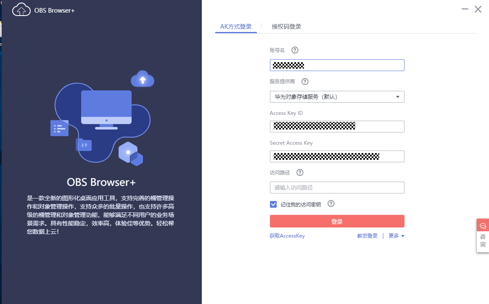
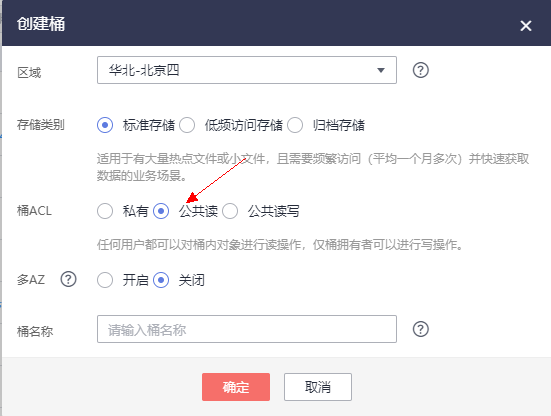
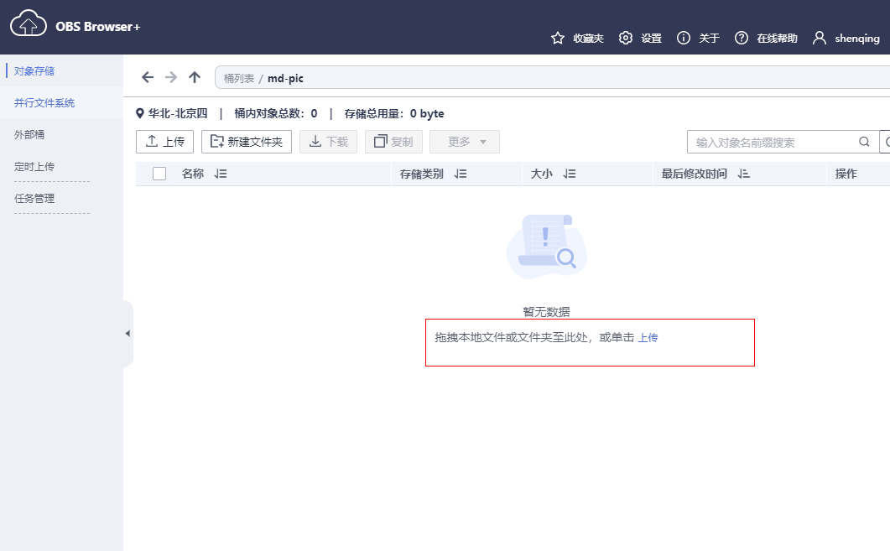
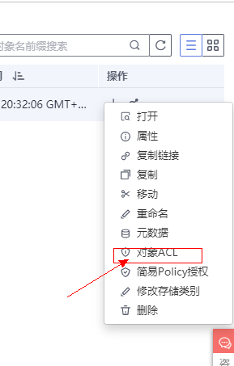
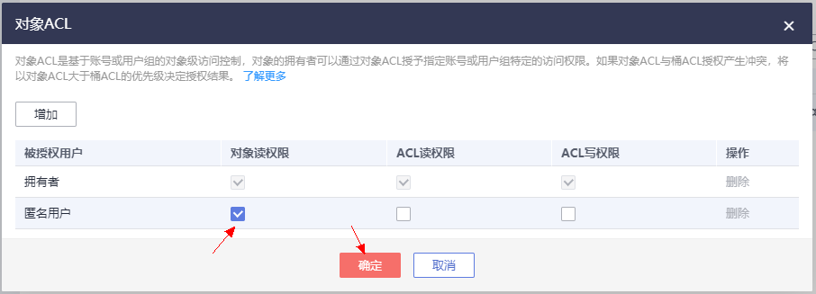
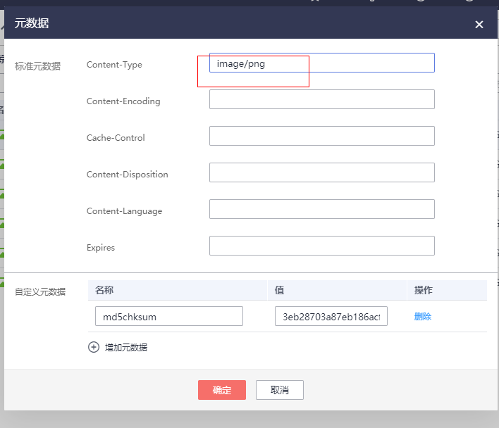
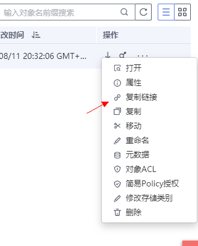

## 将华为云对象存储作为markdown图床

### 1. 注册华为云、开通对象存储服务[开通地址](https://support.huaweicloud.com/qs-obs/obs_qs_1000.html)

### 2. 下载obs browser+ [下载](https://support.huaweicloud.com/browsertg-obs/obs_03_1003.html)

### 3. 登录browser+创建一个公共读的桶

### 4. 上传对象并修改对象ACL使其成为公共可读的对象

### 5. 修改对象元数据Content-type: image/png

### 6. 在markdown中使用比如我现在这样,在browser+中复制链接使用``

